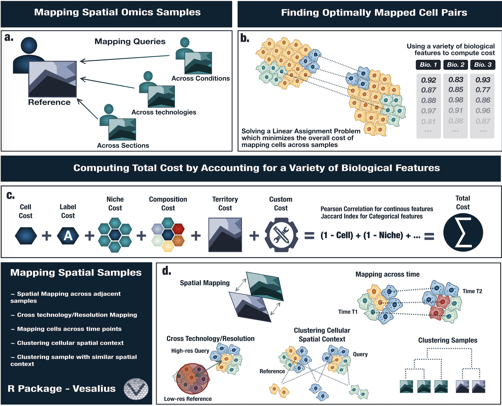

[](https://zenodo.org/badge/latestdoi/306332649)
[](https://doi.org/10.5281/zenodo.15733817)


# Vesalius

Welcome to the Vesalius GitHub page!



## What is Vesalius ?
Vesalius is an R package to decipher tissue anatomy by embracing various
image analysis techniques for high-resolution ST data. Vesalius identifies
spatially expressed genes linked to the morphology of tissue structures.

## How to install Vesalius?

Vesalius requires R 4.0.0 or higher. The list of dependencies can be found in the [DESCRIPTION FILE](https://github.com/WonLab-CS/Vesalius/blob/main/DESCRIPTION).

If you do not have `devtools` already installed, please do so beforehand.

```
install.packages("devtools")
```  
Ensure that the library has been loaded
```
library(devtools)
```
Install Vesalius via GitHub
```
install_github("WonLab-CS/Vesalius")
```

## How to use Vesalius?
Vesalius provides an internal data set taken from real Spatial Transcriptomic
data. This can be used as a dummy data set to get a feel for the Vesalius
workflow. The run time on this data sets should not exceed a minute. 

The "Quick Start" guide can be found [here](https://github.com/WonLab-CS/Vesalius/blob/main/vignettes/vesalius.Rmd)


Further in depth examples can be found in the [Vesalius Analysis Page](https://github.com/WonLab-CS/Vesalius_analysis)

Vesalius has been tested on:

* macOS Sequoia 15.0
* Red Hat Enterprise Linux 8.5 (Ootpa)


## What's next?
The Vesalius package is in its early stage of development. We would ask you to
share with us any bugs, concerns, or features you wish to see implemented.

Please open a GitHub issue or send an email to Patrick Martin (Patrick.Martin@cshs.org)
