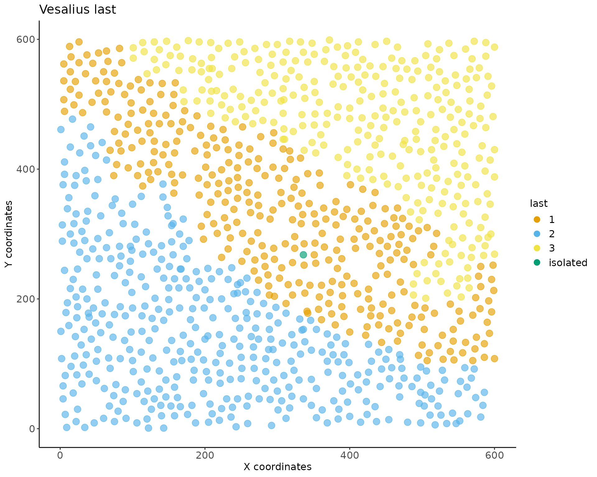
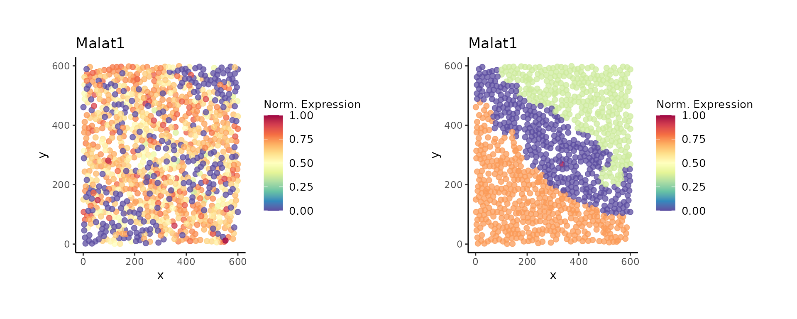
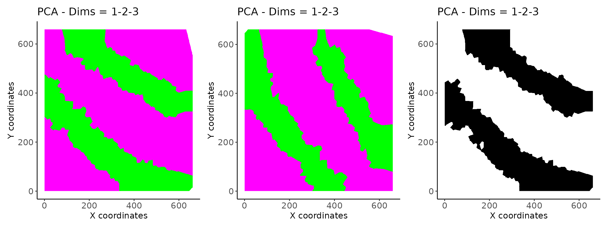
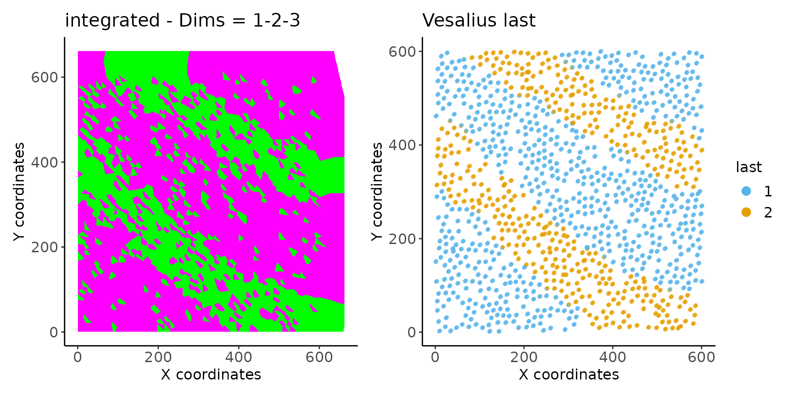

# Vesalius: Quick Start

## Vesalius: Quick Start

Do you like to live in the fast lane? Do you sigh every time you see a
long vignette? Do you wish there was a TLDR on everything?

I understand.

Welcome to the Vesalius quick start!

In this vignette, you will find a **very** short guide on how to work
with Vesalius. Vesalius provides an internal data set taken from real
Spatial transcrtiptomic data.

We show *in context* Vesalius workflows in the articles section.

For all intents and purposes, this is a dummy data set and should only
be used to get a feel for the Vesalius package. We strongly advise you
to use real and complete data sets to fully understand the Vesalius
package and its benefits.

## Introduction

Vesalius is a tool to perform high-resolution in silico anatomization
and molecular characterization from Spatial omices data without
requiring companion images. The nature of the vesalius algorithm makes
it condusive to being using on various spatial omics modalities without
requiuring substantial changes.

Vesalius achieves this by converting reducded dimensionality latent
space into gray scale images (one of each dimension). These images are
processed using various image analysis techniques such as smoothing and
segmentation.

## Loading & building a vesalius assay

### Loading data

First, let’s load the package and the data. Data originates from
slide-seqV2 data (availble at [Single Cell
Portal](https://singlecell.broadinstitute.org/single_cell/study/SCP948/robust-decomposition-of-cell-type-mixtures-in-spatial-transcriptomics#study-download)).

We took a small subset of the mouse hippocampus centered around the
Dentate Gyrus.

Here, we show an example using transcriptomic data but the same
principles will apply for other modalities. For examples using other
modalities, please refer to the other articles.

``` r
library(vesalius)
```

    ## Registered S3 method overwritten by 'imager':
    ##   method      from
    ##   plot.imlist

``` r
library(ggplot2)
library(patchwork)
library(ggpubr)
data(vesalius, package = "vesalius")
```

#### What do we have?

Once loaded we have two new variables: counts and cooridnates.

The counts are the gene counts for all genes. As per convention, columns
r epresent the spatial indices (barcodes, spots, beads,…) and rows are
the genes that were captured.

``` r
str(counts)
```

    ## Formal class 'dgCMatrix' [package "Matrix"] with 6 slots
    ##   ..@ i       : int [1:653622] 4 8 10 15 18 19 30 38 41 51 ...
    ##   ..@ p       : int [1:1053] 0 2982 6344 9623 12651 15540 18593 21462 24241 26859 ...
    ##   ..@ Dim     : int [1:2] 15932 1052
    ##   ..@ Dimnames:List of 2
    ##   .. ..$ : chr [1:15932] "0610005C13Rik" "0610007P14Rik" "0610009B22Rik" "0610009E02Rik" ...
    ##   .. ..$ : chr [1:1052] "CTCCAGCCTTGCAT" "AACCCCAAGGTAAT" "GCCCAACACACTTT" "GTCCAGAGTCTTAT" ...
    ##   ..@ x       : num [1:653622] 1 4 1 2 2 2 2 1 1 1 ...
    ##   ..@ factors : list()

The coordinates represent the x and y coordinates for each spatial
index.

``` r
str(coordinates)
```

    ## 'data.frame':    1052 obs. of  3 variables:
    ##  $ barcodes: chr  "CTCCAGCCTTGCAT" "AACCCCAAGGTAAT" "GCCCAACACACTTT" "GTCCAGAGTCTTAT" ...
    ##  $ xcoord  : num  3536 3472 3634 3589 3535 ...
    ##  $ ycoord  : num  3485 3410 3636 3257 3352 ...

In other modalities, count matrices are still required for vesalius to
run.

For example, Spatial-ATAC-seq or Spatial-cut&tag can be converted into
count matrices (more specifically tile matrices) using the [ArchR
package](https://www.archrproject.com/)

### Building a Vesalius assay

We can build a vesalius assay by simply parsing both counts and
cooridnates to the (vesalius assay contructor)\[link to manual page\].

``` r
vesalius <- build_vesalius_assay(
  coordinates = coordinates, # spatial coordinates
  counts  = counts, # count matrix
  assay = "spatial_omics", # name you wish to give your assay
  verbose = FALSE # Do you want progress messages?
)
```

#### What do we have?

A vesalius object is a container that requires at the very least spatial
indices. Here, we parsed both counts and spatial indices

``` r
vesalius
```

    ## #--------------------------------------------------------------------------------# 
    ## spatial_omics as vesalius assay containing:
    ## 
    ## 1 modifications applied to base object. 
    ## 
    ## 1052 spatial indices. 
    ## 
    ## 15932 observations in the raw count matrix. 
    ## #--------------------------------------------------------------------------------#

Count matrices can be added sperately using the `add_counts` function.

## Embedding latent space into gray scale images

### Embed Latent Space

We can use this object top embed our latent space into grey scale
images.

``` r
vesalius <- generate_embeddings(vesalius,
  dim_reduction = "PCA",
  normalization = "log_norm",
  nfeatures = 100, # Setting number of features low for low run time
  verbose = FALSE)
```

#### What do we have?

We see that we have added a set of embedding with one used one default
embedding called the “active” embedding. See section below on
*understanding active embeddings*.

    ## #--------------------------------------------------------------------------------# 
    ## spatial_omics as vesalius assay containing:
    ## 
    ## 3 modifications applied to base object. 
    ## 
    ## 1052 spatial indices used to form pixel tiles. 
    ## 
    ## 15932 observations in the log_norm count matrix. 
    ## 
    ## PCA as embeddings. 
    ## with PCA as active embedding. 
    ## #--------------------------------------------------------------------------------#

### Testing multiple embeddings

We can test out multiple embeddings and every trial will be stored into
the `vesalius_assay` object.

``` r
vesalius <- generate_embeddings(vesalius,
  dim_reduction = "UMAP",
  nfeatures = 100, # Setting number of features low for low run time
  verbose = FALSE)

vesalius <- generate_embeddings(vesalius,
  dim_reduction = "PCA",
  nfeatures = 200, # Setting number of features low for low run time
  verbose = FALSE)

vesalius <- generate_embeddings(vesalius,
  dim_reduction = "PCA",
  verbose = FALSE)
```

Every time you run a new dimensionality reduction approach it will be
appended to the previous ones. Vesalius does the same thing for
different normalisation approaches. This lets you decided which
combination you would want to use in later stages.

Note that since you might be want to use the same embedding more than
once, you will end up with more than one embedding called “PCA” for
example. In this case, each embedding or normalisation will have a
unique name.

For every subsequent embedding called PCA, the trial name will be PCA.1,
PCA.2 etc The same applies to any embedding or normalisation method you
select.

#### What do we have ?

``` r
vesalius
```

    ## #--------------------------------------------------------------------------------# 
    ## spatial_omics as vesalius assay containing:
    ## 
    ## 6 modifications applied to base object. 
    ## 
    ## 1052 spatial indices used to form pixel tiles. 
    ## 
    ## 15932 observations in the log_norm.3 count matrix. 
    ## 
    ## 4 total embedding trials
    ## with PCA.2 as active embedding. 
    ## #--------------------------------------------------------------------------------#

You can also add your own embeddings and they will be appended into
vesalius in a similar manner. You can also check the manual page for
`add_embeddings`

### Visualising Grey scale images

To visualise embeddings, we can simply plot the vesalius object and
specify which dimension we wish to view. See (imagePlot)\[link to page\]
for more information. Since we are leaving the embedding argument as the
default “last” value, we can only look at the 3 UMAP dimensions. We can
look at them simulaneously by creating RGB images with one dimension per
color channel.

``` r
p1 <- image_plot(vesalius, dimensions = 1) + labs(title = "Grey PCA dim 1")
p2 <- image_plot(vesalius, dimensions = seq(1, 3)) + labs(title = "RGB PCA")
```

If we wanted to look at “UMAP” instead, we can simply specify the
embedding. Since we used 30 dimensions for UMAP, we can use any
dimensions to build RGB images.

``` r
p3 <- image_plot(vesalius, dimensions = 1, embedding = "UMAP") +
  labs(title = "Grey UMAP dim 1")
p4 <- image_plot(vesalius, dimensions = c(1, 2, 3), embedding = "UMAP") +
  labs(title = "RGB UMAP dim 1, 2, and 3")
```

``` r
(p1 + p2) / (p3 + p4)
```


## Understanding Active Embeddings

The active embedding slot in a `vesalius_assay` object contains the
embedding values that will be used during image processing and image
segmentation.

In the examples above, we tested multiple embeddings.

``` r
get_active_embedding_tag(vesalius)
```

    ## [1] "PCA.2"

We see that “UMAP.1” is used as the active embedding. Any time the
embeddings are being used in subsequent functions they will be taken
from here as this is the “last” embedding used.

In fact, in any subsequent function that contains the keyword “last” for
one of its arguments, vesalius will use the last target created. This
can mean the last embedding used, the last count matrix or the last
segmentation / territory isolation / territory morphology used.

If you are unstaified with the results, you can always call the
embedding or trial you want to use explictely and the active slot will
be replace with a fresh version of your embeddings of choice. No need to
re-run everything from scratch!

While this flexibility can be a boon, it can also be a curse! Anytime
you explictely request an embedding or a trial it will use that fresh
instance. This means that every time the active slot will be updated and
any processing you may have done to it will be overwritten.

## Image processing and Image segmentation

### Image Processing

Once we have these images, we can apply image processing techniques to
each gray scale image.

``` r
vesalius <- regularise_image(vesalius, lambda = 1)
```

    ## #--------------------------------------------------------------------------------# 
    ## 2026-50-01/09/26 21:50:47  Converting Vesalius to Image
    ## 2026-50-01/09/26 21:50:47  Regularising Image 
    ## 2026-50-01/09/26 21:50:51  Converting Images to Vesalius
    ## #--------------------------------------------------------------------------------#

``` r
vesalius <- smooth_image(vesalius, sigma = 5, iter = 10)
```

    ## #--------------------------------------------------------------------------------# 
    ## 2026-50-01/09/26 21:50:51  Converting Vesalius to Image
    ## 2026-50-01/09/26 21:50:52  Smoothing Image Arrays 
    ## 2026-50-01/09/26 21:50:52  Converting Images to Vesalius
    ## #--------------------------------------------------------------------------------#

``` r
vesalius <- equalize_image(vesalius, sleft = 5, sright = 5)
```

    ## #--------------------------------------------------------------------------------# 
    ## 2026-50-01/09/26 21:50:52  Converting Vesalius to Image
    ## 2026-50-01/09/26 21:50:53  Equalizing Histogram 
    ## 2026-50-01/09/26 21:50:53  Converting Images to Vesalius
    ## #--------------------------------------------------------------------------------#

You can apply any image processing method you wish and in any order you
desire. Please note that the default number of dimensions for these
function is defined by `seq(1,3)` giving the first three dimensions. If
working with PCA, please set this argument according to how many
dimensions you wish to process.

This also alows for the selction of abitrary of PCs. For example, based
on the grey scale images, you might decided that this would be a better
choice of PCs

``` r
# Selecting a subset of PCs
dims <- c(1, 3, 4, 5, 7:11)

# running smoothing o
vesalius <- regularise_image(vesalius,
  dimensions = dims,
  embedding = "PCA",
  verbose = FALSE)
vesalius <- equalize_image(vesalius,
  dimensions = dims,
  verbose = FALSE)
vesalius <- smooth_image(vesalius,
  dimensions = dims,
  iter = 10,
  sigma = 1,
  verbose = FALSE)
```

In this example, we explicetely requested the *PCA* embedding. This
means that we will take a fresh instance of the *PCA* embedding and use
this as our active embedding. Once specified, all subsequent functions
will use this new active embedding unless specified otherwise.

However, note that dimensions are being parsed at every step. Only the
images coressponding to these dimensions will be processed. Vesalius
still retains the other ones just in case.

### Image segmentation

Vesalius will attempts to segment the images into color segments.
Vesalius use a kmeans clustering approach to segment grey scale images.
Note that the segmentation here is applied to the whole stack and not
individually.

The goal is top obtain colour segments that we can subdivived into
territories.

``` r
vesalius <- segment_image(vesalius,
  method = "kmeans",
  col_resolution = 2,
  verbose = FALSE)
```

### What do we have?

We can see that the vesalius_assay object now contains some more
information related to the segmentation.

``` r
vesalius
```

    ## #--------------------------------------------------------------------------------# 
    ## spatial_omics as vesalius assay containing:
    ## 
    ## 10 modifications applied to base object. 
    ## 
    ## 1052 spatial indices used to form pixel tiles. 
    ## 
    ## 15932 observations in the log_norm.3 count matrix. 
    ## 
    ## 4 total embedding trials
    ## with PCA.2 as active embedding. 
    ## 
    ## 1 Segmentation trials. 
    ## 0 Territory trials. 
    ## 0 Morphing trials. 
    ## 0 Layering trials. 
    ## #--------------------------------------------------------------------------------#

We can also have a look at the results of the image segmentation.

``` r
p5 <- image_plot(vesalius) + labs(title = "Segments only")
print(p5)
```


Kmeans is the default setting for image segmentation but Vesalius also
provides *louvain* and *leiden* based approaches.

## Isolating territories

### Isolating territories from colour segments

The final step is to isolate color segments into seperate territories.
Similar color segments may be of the same colour but are seperated in 2D
space. We want to be able to isolate each patch. For this, we can use
the `isolate_territories` function.

``` r
vesalius <- isolate_territories(vesalius, capture_radius = 0.05)
```

    ## #--------------------------------------------------------------------------------# 
    ## 2026-50-01/09/26 21:50:56  Pooling Segment  1 
    ## 2026-50-01/09/26 21:50:56  Pooling Segment  2 
    ## #--------------------------------------------------------------------------------#

#### What do we have?

Now we can have a look at the isolated territories. We can keep track of
how many instances of image segmentation and image manipulation we have
gone through.

``` r
vesalius
```

    ## #--------------------------------------------------------------------------------# 
    ## spatial_omics as vesalius assay containing:
    ## 
    ## 11 modifications applied to base object. 
    ## 
    ## 1052 spatial indices used to form pixel tiles. 
    ## 
    ## 15932 observations in the log_norm.3 count matrix. 
    ## 
    ## 4 total embedding trials
    ## with PCA.2 as active embedding. 
    ## 
    ## 1 Segmentation trials. 
    ## 1 Territory trials. 
    ## 0 Morphing trials. 
    ## 0 Layering trials. 
    ## #--------------------------------------------------------------------------------#

### Visualizing Territories

We can plot our territories using vesalius plotting functions. Note that
this is a `ggplot` object as such it is customisable using `ggplot2`
functionalities.

``` r
p6 <- territory_plot(vesalius, cex_pt = 3.5)
p6
```



## Comparing territories

Once we have our territories, we can compare the expression of genes
between territories.

``` r
vesalius <- identify_markers(vesalius, seed = 1, query = 2)
```

    ## #--------------------------------------------------------------------------------# 
    ## 2026-50-01/09/26 21:50:57 ===> Computing DEGs in spatial_omics <===
    ## 2026-50-01/09/26 21:50:57 ===> 1 VS 2 <=== 
    ## #--------------------------------------------------------------------------------#

``` r
deg <- get_markers(vesalius)
```

And finally we can visualise the expression of our genes of interest.
You can parse more than one gene. Here we show the overall expression
profile of **Malat1** but also its mean expression in each territory.

``` r
p7 <- view_gene_expression(vesalius, genes = "Malat1")
p8 <- view_gene_expression(vesalius, genes = "Malat1", as_layer = TRUE)
p7 + p8
```



## Mapping Cells across samples

Another key features of Vesalius is to be able to map cells across
samples. Here, we will show a quick break down of how to achieve this. A
more in depth view of cell mapping is available in the [Vesalius
analysis repository](https://github.com/WonLab-CS/Vesalius_analysis)

### Mapping cells

First, we build 2 vesalius objects that we have process independantly.
The jitter territory is the same as the original version but we flipped
the coordinates, added noise to coordinates and counts, and remove a few
randomly sampled locations.

``` r
# load vesalius data 
data(vesalius)

# Create Vesalius object for processing
vesalius <- build_vesalius_assay(coordinates, counts)
```

    ## #--------------------------------------------------------------------------------# 
    ## 2026-50-01/09/26 21:50:59  Checking Coordinates in spatial_omics 
    ## 2026-51-01/09/26 21:51:00  Checking Counts in spatial_omics 
    ## 2026-51-01/09/26 21:51:00  Calculating Assay scale from coordinates
    ## #--------------------------------------------------------------------------------#

``` r
cells <- sample(LETTERS[1:6], size = nrow(vesalius@tiles),replace =T)
names(cells) <- vesalius@tiles$barcodes
vesalius <- add_cells(vesalius, cells = cells, add_name = "Cells")
```

    ## #--------------------------------------------------------------------------------# 
    ## 2026-51-01/09/26 21:51:00  Adding cell labels to Cells territory column in spatial_omics 
    ## #--------------------------------------------------------------------------------#

``` r
jitter_ves <- build_vesalius_assay(jitter_coord, jitter_counts)
```

    ## #--------------------------------------------------------------------------------# 
    ## 2026-51-01/09/26 21:51:00  Checking Coordinates in spatial_omics 
    ## 2026-51-01/09/26 21:51:01  Checking Counts in spatial_omics 
    ## 2026-51-01/09/26 21:51:02  Calculating Assay scale from coordinates
    ## #--------------------------------------------------------------------------------#

``` r
cells <- sample(LETTERS[1:6], size = nrow(jitter_ves@tiles),replace =T)
names(cells) <- jitter_ves@tiles$barcodes
jitter_ves <- add_cells(jitter_ves, cells = cells, add_name = "Cells")
```

    ## #--------------------------------------------------------------------------------# 
    ## 2026-51-01/09/26 21:51:02  Adding cell labels to Cells territory column in spatial_omics 
    ## #--------------------------------------------------------------------------------#

``` r
vesalius <- generate_embeddings(vesalius,
    filter_threshold = 1,
    filter_grid = 1)
```

    ## #--------------------------------------------------------------------------------# 
    ## 2026-51-01/09/26 21:51:02 ===> Generating Tiles in spatial_omics <===
    ## 2026-51-01/09/26 21:51:02  Generating Voronoi Tesselation 
    ## 2026-51-01/09/26 21:51:02  Filtering Tiles
    ## 2026-51-01/09/26 21:51:02  Rasterising Tiles 
    ## 2026-51-01/09/26 21:51:06  Adjusting count matrix
    ## 2026-51-01/09/26 21:51:06 ===> Pre-processing counts in spatial_omics <===
    ## 2026-51-01/09/26 21:51:07 ===> Compute Latent Space in spatial_omics <===
    ## 2026-51-01/09/26 21:51:07  Running Principal Component Analysis 
    ## 2026-51-01/09/26 21:51:09  Converting PCA Embedding Values to gray scale 
    ## #--------------------------------------------------------------------------------#

``` r
vesalius <- smooth_image(vesalius, embedding = "PCA", sigma = 5, iter = 10)
```

    ## #--------------------------------------------------------------------------------# 
    ## 2026-51-01/09/26 21:51:09  Converting Vesalius to Image
    ## 2026-51-01/09/26 21:51:09  Smoothing Image Arrays 
    ## 2026-51-01/09/26 21:51:10  Converting Images to Vesalius
    ## #--------------------------------------------------------------------------------#

``` r
vesalius <- equalize_image(vesalius, sleft = 5, sright = 5)
```

    ## #--------------------------------------------------------------------------------# 
    ## 2026-51-01/09/26 21:51:10  Converting Vesalius to Image
    ## 2026-51-01/09/26 21:51:11  Equalizing Histogram 
    ## 2026-51-01/09/26 21:51:11  Converting Images to Vesalius
    ## #--------------------------------------------------------------------------------#

``` r
vesalius <- segment_image(vesalius, col_resolution = 2)
```

    ## #--------------------------------------------------------------------------------# 
    ## 2026-51-01/09/26 21:51:11  Segmenting Image using kmeans 
    ## #--------------------------------------------------------------------------------#

``` r
vesalius <- isolate_territories(vesalius)
```

    ## #--------------------------------------------------------------------------------# 
    ## 2026-51-01/09/26 21:51:11  Pooling Segment  1 
    ## 2026-51-01/09/26 21:51:11  Pooling Segment  2 
    ## #--------------------------------------------------------------------------------#

``` r
jitter_ves <- generate_embeddings(jitter_ves,
    filter_threshold = 1,
    filter_grid = 1)
```

    ## #--------------------------------------------------------------------------------# 
    ## 2026-51-01/09/26 21:51:11 ===> Generating Tiles in spatial_omics <===
    ## 2026-51-01/09/26 21:51:11  Generating Voronoi Tesselation 
    ## 2026-51-01/09/26 21:51:11  Filtering Tiles
    ## 2026-51-01/09/26 21:51:11  Rasterising Tiles 
    ## 2026-51-01/09/26 21:51:13  Adjusting count matrix
    ## 2026-51-01/09/26 21:51:13 ===> Pre-processing counts in spatial_omics <===
    ## 2026-51-01/09/26 21:51:19 ===> Compute Latent Space in spatial_omics <===
    ## 2026-51-01/09/26 21:51:19  Running Principal Component Analysis 
    ## 2026-51-01/09/26 21:51:20  Converting PCA Embedding Values to gray scale 
    ## #--------------------------------------------------------------------------------#

``` r
jitter_ves <- smooth_image(jitter_ves, embedding = "PCA", sigma = 5, iter = 10)
```

    ## #--------------------------------------------------------------------------------# 
    ## 2026-51-01/09/26 21:51:20  Converting Vesalius to Image
    ## 2026-51-01/09/26 21:51:20  Smoothing Image Arrays 
    ## 2026-51-01/09/26 21:51:21  Converting Images to Vesalius
    ## #--------------------------------------------------------------------------------#

``` r
jitter_ves <- equalize_image(jitter_ves, sleft = 5, sright = 5)
```

    ## #--------------------------------------------------------------------------------# 
    ## 2026-51-01/09/26 21:51:21  Converting Vesalius to Image
    ## 2026-51-01/09/26 21:51:22  Equalizing Histogram 
    ## 2026-51-01/09/26 21:51:22  Converting Images to Vesalius
    ## #--------------------------------------------------------------------------------#

``` r
jitter_ves <- segment_image(jitter_ves, col_resolution = 2)
```

    ## #--------------------------------------------------------------------------------# 
    ## 2026-51-01/09/26 21:51:22  Segmenting Image using kmeans 
    ## #--------------------------------------------------------------------------------#

``` r
jitter_ves <- isolate_territories(jitter_ves)
```

    ## #--------------------------------------------------------------------------------# 
    ## 2026-51-01/09/26 21:51:22  Pooling Segment  1 
    ## 2026-51-01/09/26 21:51:22  Pooling Segment  2 
    ## #--------------------------------------------------------------------------------#

Next, we can proceed with the mapping of cells on to the other. We will
run the mapping using cell (feature), niche, territory similarity and
cell composition.

``` r
matched <- map_assays(vesalius,
    jitter_ves,
    threshold = 0,
    use_cost = c("feature","niche","territory","composition"),
    batch_size = 500,
    epoch = 5,
    jitter = 1)
```

    ## #--------------------------------------------------------------------------------# 
    ## 2026-51-01/09/26 21:51:22  Extracting assay signal
    ## 2026-51-01/09/26 21:51:22  Computing Feature cost in spatial_omics 
    ## 2026-51-01/09/26 21:51:23  Getting Neighborhoods in spatial_omics 
    ## 2026-51-01/09/26 21:51:23  Computing Neighborhood cost in spatial_omics 
    ## 2026-51-01/09/26 21:51:24  Computing Territory cost in spatial_omics 
    ## 2026-51-01/09/26 21:51:26  Computing Niche Composition Index in spatial_omics 
    ## 2026-51-01/09/26 21:51:31  Filtering Cost Matrices 
    ## 2026-51-01/09/26 21:51:31  Mapping query to seed - Epoch =  1 
    ## 2026-51-01/09/26 21:51:32  Mapping query to seed - Epoch =  2 
    ## 2026-51-01/09/26 21:51:32  Mapping query to seed - Epoch =  3 
    ## 2026-51-01/09/26 21:51:32  Mapping query to seed - Epoch =  4 
    ## 2026-51-01/09/26 21:51:32  Mapping query to seed - Epoch =  5 
    ## 2026-51-01/09/26 21:51:32  Filtering Mapped Indices 
    ## #--------------------------------------------------------------------------------#

The mapping produces a new vesalius object with mapped coordinates for
the query data set. In this case our query was `jitter_ves`.

From here, we can treat this new object as a frech data sets with new
coordinates. As such:

``` r
matched <- generate_embeddings(matched,
    dim_reduction = "PCA",
  nfeatures = 200, 
  verbose = FALSE)
matched <- smooth_image(matched, sigma = 5, iter = 10)
```

    ## #--------------------------------------------------------------------------------# 
    ## 2026-51-01/09/26 21:51:41  Converting Vesalius to Image
    ## 2026-51-01/09/26 21:51:42  Smoothing Image Arrays 
    ## 2026-51-01/09/26 21:51:43  Converting Images to Vesalius
    ## #--------------------------------------------------------------------------------#

``` r
matched <- equalize_image(matched, sleft = 5, sright = 5)
```

    ## #--------------------------------------------------------------------------------# 
    ## 2026-51-01/09/26 21:51:43  Converting Vesalius to Image
    ## 2026-51-01/09/26 21:51:44  Equalizing Histogram 
    ## 2026-51-01/09/26 21:51:44  Converting Images to Vesalius
    ## #--------------------------------------------------------------------------------#

``` r
matched <- segment_image(matched,col_resolution = 2)
```

    ## #--------------------------------------------------------------------------------# 
    ## 2026-51-01/09/26 21:51:44  Segmenting Image using kmeans 
    ## #--------------------------------------------------------------------------------#

We can then look at the resulting embeddings

``` r
m <- image_plot(vesalius)
m1 <- image_plot(jitter_ves)
m2 <- image_plot(matched)

m + m1 + m2
```



We can also look at the new territories.

``` r
t <- territory_plot(vesalius)
t1 <- territory_plot(jitter_ves)
t2 <- territory_plot(matched)
t + t1 + t2
```


### Integrating data sets

Once we have our data sets and the new set of coordinates, we can
integrate the data sets to obtain an integrate mapping object upon which
we can perform differential gene expression analysis.

``` r
inter <- integrate_assays(matched,
    vesalius)
```

    ## #--------------------------------------------------------------------------------# 
    ## 2026-51-01/09/26 21:51:50  Intergrating Counts

    ## Warning in merge_coordinates(mapped, reference,
    ## rownames(integrated$integrated)): No duplicated coordinates allowed - Adding
    ## noise!

    ## 2026-51-01/09/26 21:51:59 ===> Generating Tiles in spatial_omics <===
    ## 2026-51-01/09/26 21:51:59  Generating Voronoi Tesselation 
    ## 2026-51-01/09/26 21:51:59  Filtering Tiles
    ## 2026-51-01/09/26 21:51:59  Rasterising Tiles 
    ## 2026-52-01/09/26 21:52:03  Adjusting count matrix
    ## 2026-52-01/09/26 21:52:03  Setting integrated as active embedding 
    ## 2026-52-01/09/26 21:52:03  Setting inferred as active count matrix 
    ## #--------------------------------------------------------------------------------#

Since this data set now contains an integrated latent space, we can also
call territories on this object. There is no need to create new
embeddings. They are provided during integration.

``` r
inter <- smooth_image(inter, sigma = 5, iter = 10)
```

    ## #--------------------------------------------------------------------------------# 
    ## 2026-52-01/09/26 21:52:03  Converting Vesalius to Image
    ## 2026-52-01/09/26 21:52:05  Smoothing Image Arrays 
    ## 2026-52-01/09/26 21:52:05  Converting Images to Vesalius
    ## #--------------------------------------------------------------------------------#

``` r
inter <- equalize_image(inter, sleft = 5, sright = 5)
```

    ## #--------------------------------------------------------------------------------# 
    ## 2026-52-01/09/26 21:52:05  Converting Vesalius to Image
    ## 2026-52-01/09/26 21:52:06  Equalizing Histogram 
    ## 2026-52-01/09/26 21:52:06  Converting Images to Vesalius
    ## #--------------------------------------------------------------------------------#

``` r
inter <- segment_image(inter, col_resolution = 2)
```

    ## #--------------------------------------------------------------------------------# 
    ## 2026-52-01/09/26 21:52:06  Segmenting Image using kmeans 
    ## #--------------------------------------------------------------------------------#

We can view the resulting embeddings and territories.

``` r
i <- image_plot(inter)
i1 <- territory_plot(inter)

i + i1
```



### DEG analysis between samples

Finally, we can look at DEG analysis between samples in specific
territories.

``` r
inter <- identify_markers(inter, sample = TRUE)
```

    ## #--------------------------------------------------------------------------------# 
    ## 2026-52-01/09/26 21:52:09  No territory Specified - Comparing all territories
    ## 2026-52-01/09/26 21:52:09 ===> Computing DEGs in spatial_omics <===
    ## 2026-52-01/09/26 21:52:09 ===> 1_reference VS remaining_matched <=== 
    ## 2026-52-01/09/26 21:52:09 ===> 2_reference VS remaining_matched <=== 
    ## #--------------------------------------------------------------------------------#

``` r
degs <- get_markers(inter)
head(degs)
```

    ##         genes       p_value   p_value_adj  seed_pct query_pct fold_change
    ## Lrrtm4 Lrrtm4 1.128087e-128 2.933026e-126 0.5000000 0.9772152  -0.9777009
    ## Kcnip4 Kcnip4 7.078359e-121 1.755433e-118 0.7006079 0.9974684  -0.8918530
    ## Lsamp   Lsamp  7.834842e-51  1.410272e-49 1.0000000 1.0000000  -0.4371347
    ## Kcnd2   Kcnd2 1.047206e-116 2.471407e-114 0.3465046 0.9367089  -0.7452150
    ## Dlg2     Dlg2 6.357439e-102  1.176126e-99 0.5851064 0.9924051  -0.6055463
    ## Grin2a Grin2a 1.782065e-122 4.472983e-120 0.4498480 0.9696203  -0.8289342
    ##        effect_size        seed             query
    ## Lrrtm4    1.409704 1_reference remaining_matched
    ## Kcnip4    1.409704 1_reference remaining_matched
    ## Lsamp     1.008041 1_reference remaining_matched
    ## Kcnd2     1.409704 1_reference remaining_matched
    ## Dlg2      1.409704 1_reference remaining_matched
    ## Grin2a    1.409704 1_reference remaining_matched

## Session Info

``` r
sessionInfo()
```

    ## R version 4.5.2 (2025-10-31)
    ## Platform: x86_64-pc-linux-gnu
    ## Running under: Ubuntu 24.04.3 LTS
    ## 
    ## Matrix products: default
    ## BLAS:   /usr/lib/x86_64-linux-gnu/openblas-pthread/libblas.so.3 
    ## LAPACK: /usr/lib/x86_64-linux-gnu/openblas-pthread/libopenblasp-r0.3.26.so;  LAPACK version 3.12.0
    ## 
    ## locale:
    ##  [1] LC_CTYPE=C.UTF-8       LC_NUMERIC=C           LC_TIME=C.UTF-8       
    ##  [4] LC_COLLATE=C.UTF-8     LC_MONETARY=C.UTF-8    LC_MESSAGES=C.UTF-8   
    ##  [7] LC_PAPER=C.UTF-8       LC_NAME=C              LC_ADDRESS=C          
    ## [10] LC_TELEPHONE=C         LC_MEASUREMENT=C.UTF-8 LC_IDENTIFICATION=C   
    ## 
    ## time zone: UTC
    ## tzcode source: system (glibc)
    ## 
    ## attached base packages:
    ## [1] stats     graphics  grDevices utils     datasets  methods   base     
    ## 
    ## other attached packages:
    ## [1] future_1.68.0       ggpubr_0.6.2        patchwork_1.3.2    
    ## [4] ggplot2_4.0.1       vesalius_2.0.0      Biobase_2.70.0     
    ## [7] BiocGenerics_0.56.0 generics_0.1.4     
    ## 
    ## loaded via a namespace (and not attached):
    ##   [1] RcppAnnoy_0.0.22            splines_4.5.2              
    ##   [3] later_1.4.5                 bitops_1.0-9               
    ##   [5] tibble_3.3.0                polyclip_1.10-7            
    ##   [7] fastDummies_1.7.5           lifecycle_1.0.5            
    ##   [9] Rdpack_2.6.4                rstatix_0.7.3              
    ##  [11] edgeR_4.8.2                 doParallel_1.0.17          
    ##  [13] globals_0.18.0              lattice_0.22-7             
    ##  [15] MASS_7.3-65                 readbitmap_0.1.5           
    ##  [17] backports_1.5.0             magrittr_2.0.4             
    ##  [19] limma_3.66.0                plotly_4.11.0              
    ##  [21] sass_0.4.10                 rmarkdown_2.30             
    ##  [23] jquerylib_0.1.4             yaml_2.3.12                
    ##  [25] httpuv_1.6.16               otel_0.2.0                 
    ##  [27] Seurat_5.4.0                NMF_0.28                   
    ##  [29] sctransform_0.4.2           spam_2.11-3                
    ##  [31] sp_2.2-0                    spatstat.sparse_3.1-0      
    ##  [33] reticulate_1.44.1           cowplot_1.2.0              
    ##  [35] pbapply_1.7-4               RColorBrewer_1.1-3         
    ##  [37] abind_1.4-8                 Rtsne_0.17                 
    ##  [39] GenomicRanges_1.62.1        purrr_1.2.1                
    ##  [41] RCurl_1.98-1.17             imagerExtra_1.3.2          
    ##  [43] IRanges_2.44.0              S4Vectors_0.48.0           
    ##  [45] ggrepel_0.9.6               irlba_2.3.5.1              
    ##  [47] kohonen_3.0.12              listenv_0.10.0             
    ##  [49] spatstat.utils_3.2-0        goftest_1.2-3              
    ##  [51] RSpectra_0.16-2             spatstat.random_3.4-3      
    ##  [53] fitdistrplus_1.2-4          parallelly_1.46.1          
    ##  [55] pkgdown_2.2.0               codetools_0.2-20           
    ##  [57] DelayedArray_0.36.0         RcppRoll_0.3.1             
    ##  [59] tidyselect_1.2.1            UCSC.utils_1.6.1           
    ##  [61] farver_2.1.2                imager_1.0.8               
    ##  [63] matrixStats_1.5.0           stats4_4.5.2               
    ##  [65] spatstat.explore_3.6-0      Seqinfo_1.0.0              
    ##  [67] jsonlite_2.0.0              bmp_0.3.1                  
    ##  [69] Formula_1.2-5               progressr_0.18.0           
    ##  [71] ggridges_0.5.7              survival_3.8-3             
    ##  [73] iterators_1.0.14            systemfonts_1.3.1          
    ##  [75] foreach_1.5.2               TreeTools_2.0.0            
    ##  [77] ggnewscale_0.5.2            tools_4.5.2                
    ##  [79] ragg_1.5.0                  ica_1.0-3                  
    ##  [81] Rcpp_1.1.0                  glue_1.8.0                 
    ##  [83] gridExtra_2.3               SparseArray_1.10.8         
    ##  [85] xfun_0.55                   DESeq2_1.50.2              
    ##  [87] MatrixGenerics_1.22.0       GenomeInfoDb_1.46.2        
    ##  [89] dplyr_1.1.4                 withr_3.0.2                
    ##  [91] BiocManager_1.30.27         fastmap_1.2.0              
    ##  [93] shinyjs_2.1.0               digest_0.6.39              
    ##  [95] R6_2.6.1                    mime_0.13                  
    ##  [97] textshaping_1.0.4           colorspace_2.1-2           
    ##  [99] scattermore_1.2             tensor_1.5.1               
    ## [101] jpeg_0.1-11                 spatstat.data_3.1-9        
    ## [103] tidyr_1.3.2                 data.table_1.18.0          
    ## [105] httr_1.4.7                  htmlwidgets_1.6.4          
    ## [107] S4Arrays_1.10.1             uwot_0.2.4                 
    ## [109] pkgconfig_2.0.3             gtable_0.3.6               
    ## [111] registry_0.5-1              lmtest_0.9-40              
    ## [113] S7_0.2.1                    XVector_0.50.0             
    ## [115] htmltools_0.5.9             carData_3.0-5              
    ## [117] pwr_1.3-0                   dotCall64_1.2              
    ## [119] fftwtools_0.9-11            SeuratObject_5.3.0         
    ## [121] scales_1.4.0                png_0.1-8                  
    ## [123] spatstat.univar_3.1-5       tvR_0.3.3                  
    ## [125] knitr_1.51                  Signac_1.16.0              
    ## [127] reshape2_1.4.5              nlme_3.1-168               
    ## [129] cachem_1.1.0                zoo_1.8-15                 
    ## [131] stringr_1.6.0               KernSmooth_2.23-26         
    ## [133] parallel_4.5.2              miniUI_0.1.2               
    ## [135] desc_1.4.3                  infix_0.1.0                
    ## [137] pillar_1.11.1               grid_4.5.2                 
    ## [139] vctrs_0.6.5                 TreeDist_2.11.1            
    ## [141] RANN_2.6.2                  PlotTools_0.3.1            
    ## [143] promises_1.5.0              car_3.1-3                  
    ## [145] xtable_1.8-4                cluster_2.1.8.1            
    ## [147] evaluate_1.0.5              cli_3.6.5                  
    ## [149] locfit_1.5-9.12             compiler_4.5.2             
    ## [151] Rsamtools_2.26.0            rlang_1.1.7                
    ## [153] crayon_1.5.3                rngtools_1.5.2             
    ## [155] ggsignif_0.6.4              future.apply_1.20.1        
    ## [157] labeling_0.4.3              plyr_1.8.9                 
    ## [159] fs_1.6.6                    stringi_1.8.7              
    ## [161] viridisLite_0.4.2           deldir_2.0-4               
    ## [163] gridBase_0.4-7              BiocParallel_1.44.0        
    ## [165] Biostrings_2.78.0           tiff_0.1-12                
    ## [167] lazyeval_0.2.2              spatstat.geom_3.6-1        
    ## [169] Matrix_1.7-4                RcppHNSW_0.6.0             
    ## [171] bit64_4.6.0-1               statmod_1.5.1              
    ## [173] shiny_1.12.1                SummarizedExperiment_1.40.0
    ## [175] rbibutils_2.4               ROCR_1.0-11                
    ## [177] broom_1.0.11                igraph_2.2.1               
    ## [179] bslib_0.9.0                 fastmatch_1.1-6            
    ## [181] bit_4.6.0                   ape_5.8-1
